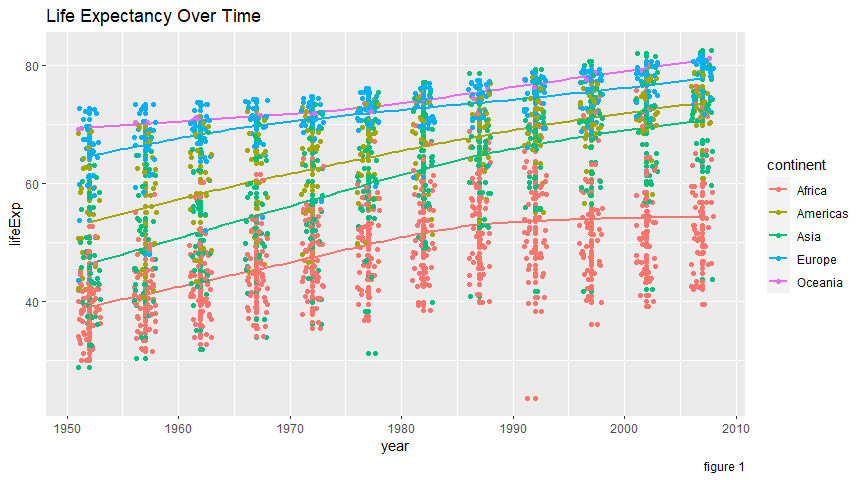

Final Report
================
Alex Cluff
4/14/2021

  Gapminder is an independent non-profit organization that promotes a
fact-based worldview. The dataset in question is a excerpt of the open
data available from gapminder. The data consists of life expectancy, GDP
per capita, and population by country. The time frame ranges from 1952
to 2007 in increments of 5 years. The GDP is in USD and is adjusted for
inflation. There are a total of 142 countries included. Only countries
that have existed for the entire time frame are included. This excludes
all of the countries that became independent from the dissolution of the
Soviet Union as well as many others. For this analysis I will be
focusing on finding predictors or causes of low or high life expectancy.

<!-- -->

  With time comes better technology, innovation, health care, and many
more things. All of these come into effect for life expectancy. What is
very interesting is when there is a large deviation from the general
upward trend and what is can tell us about history.

<!-- -->

Africa stands out in this graph. Not only is it much lower over time,
but it’s trend slowed down in progress since the 80s. There was the
Ethiopian famine, the Rwandan genocide (distinctly visible in 1992) as
well as the HIV epidemic. There are also see some sharp drops in Asia.
Below are the decreases in life expectancy in Africa and Asia. The
largest decreases in Asia correspond with genocide in Cambodia and
violent dictatorships.

<!-- -->

Figure 1 (above) is a great visualization of how the distribution of
life expectancy has changed over the years.

  Although it might seem reasonable that overpopulation causes decreases
in quality of life and life expectancy, that is not the case. Population
has little to no effect on life expectancy (as seen in figure 4 below).
It may be becoming true in more recent years. Countries that have a
higher population tend to deal with air pollution more. We have yet to
see the lasting effects of living day-to-day life in an environment like
that. GDP on the other hand has a strong correlation with life
expectancy. The rank of continent’s median GDP is in the same order as
life expectancy in the box-plot. I mentioned earlier of the advancements
in health care and technology are the reason for the increase in life
expectancy over time. The GDP of a country can describe what kind of
access the average person in each of these countries has to these
advancements. The following graphs and tables are exclusive to 2007 for
this reason. Picking a single time out of the data takes out much of the
correlation that is taking place over time and focuses on GDP much
better.

<!-- -->

<!-- -->

The relationship between life expectancy and GDP is very evident in
figure 6 (above). However, the distribution of GDP shows that the
relationship would be much closer to linear with a log scale. Life
expectancy and GDP is graphed below in figure 7 with a log scale on the
x axis. This shows how well log(GDP) along with the year would fit into
a linear regression model.

<!-- -->

  In conclusion, there are many suitable predictors of life expectancy.
High GDP will result in a longer life on average. Poverty on the other
hand has the opposite effect. Violent events such as genocide can also
be identified by looking at large deviations in life expectancy.
